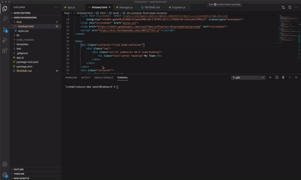

# Homework Week 10 - Team Profile Generator

## Description:

Built a CLI that asks information for employees, such as name, id, email ect. There are different options for each type of employee, and 3 different employees that can be inputed. Once you have inputed as many employees as you need, the employees are generated to a finished file that can be rendered in the browser. 

## Link to repo:

https://github.com/campbelllm/teamProfileGenerator

## Team Profile Preview

